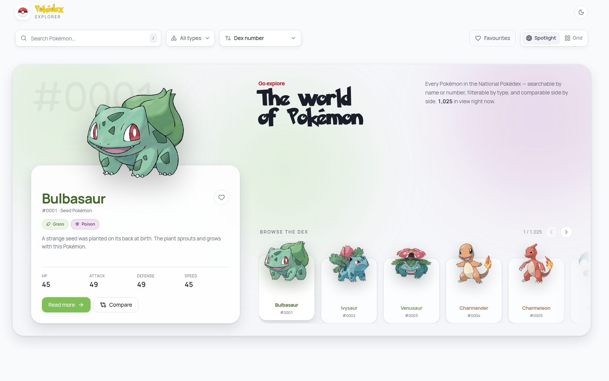
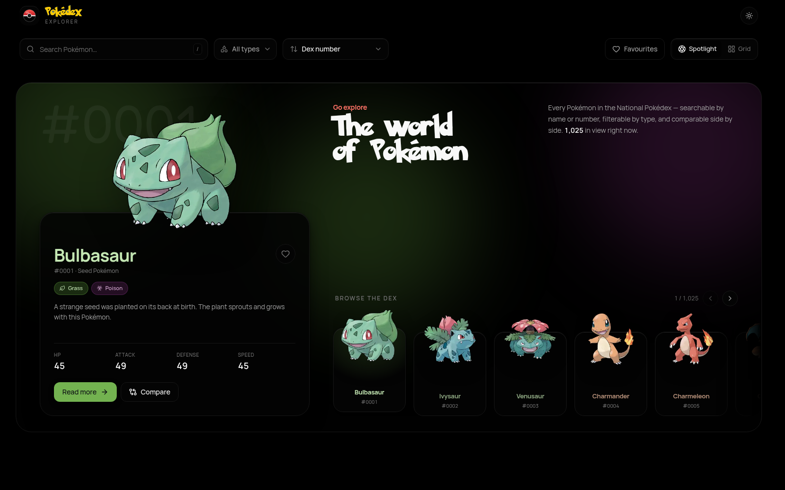
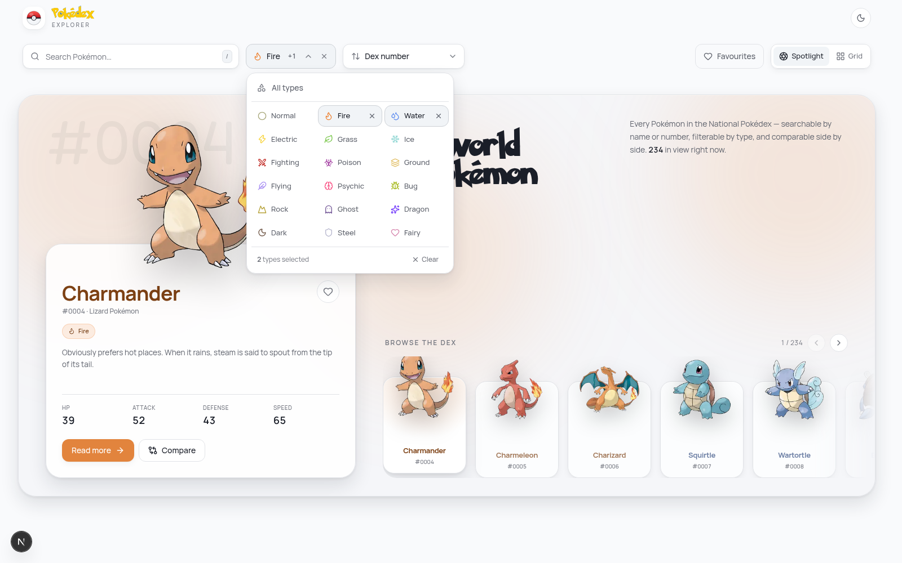
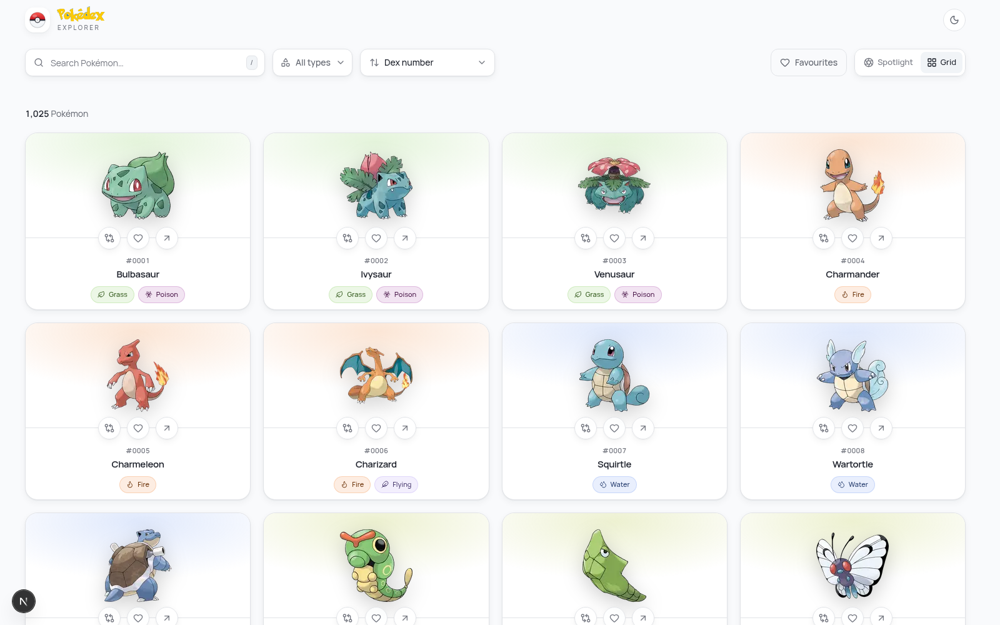
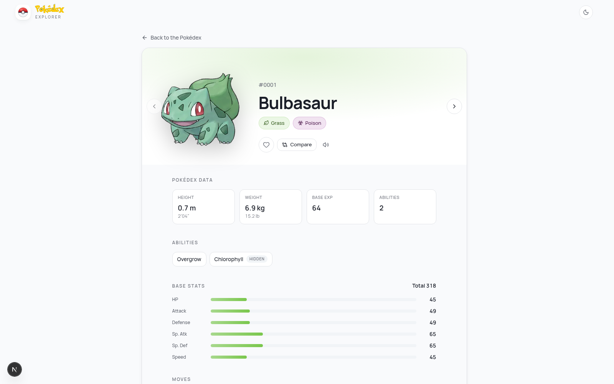
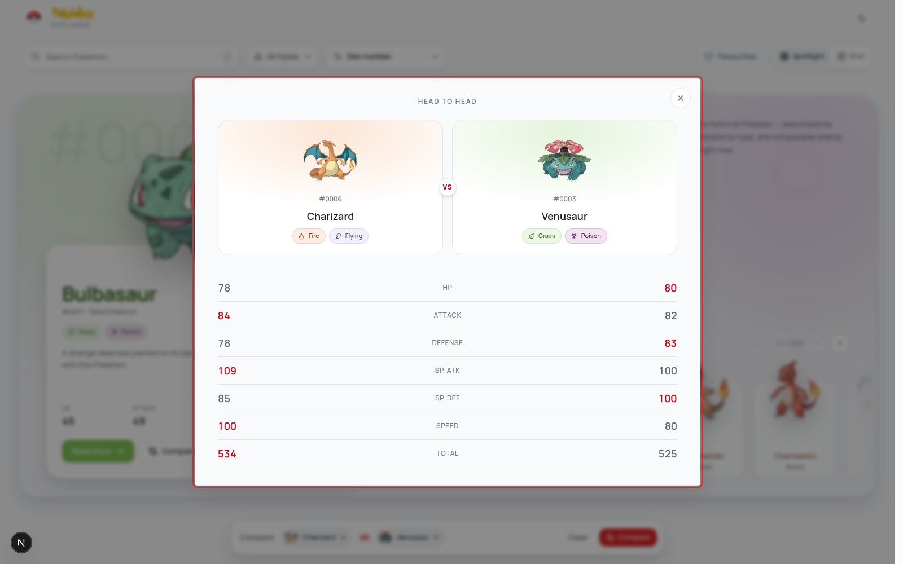
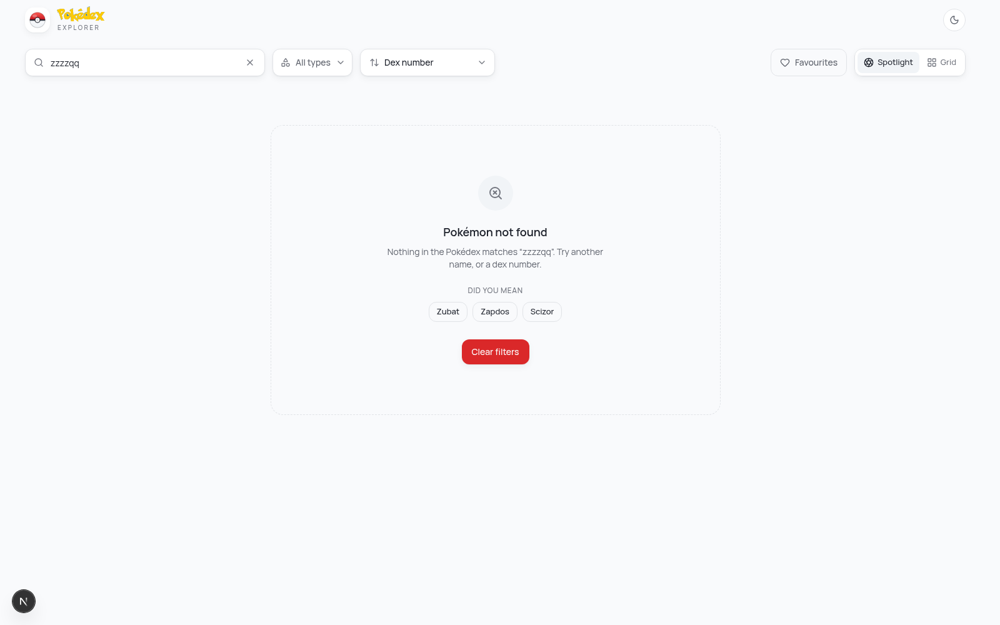
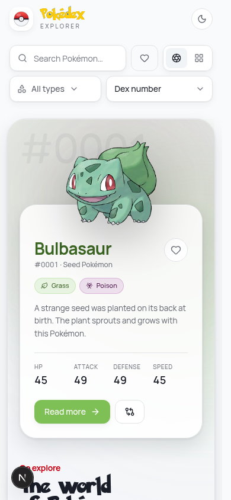

# Pokédex Explorer

A production-grade Pokédex built on the free [PokéAPI](https://pokeapi.co). Search, filter, sort
and compare all 1,025 Pokémon — with a cinematic spotlight view, a virtualised grid, multi-type
filtering, full keyboard support and a light/dark design system.



---

## The Assignment

Build a frontend that consumes a public API — [PokéAPI](https://pokeapi.co) — and presents it through a
polished interface. The brief asked for the API integration to work, and for the result to demonstrate
UI design, loading states, error handling, responsiveness and component architecture.

### Required, and where it lives

| # | Requirement | How it is met | Code |
|---|---|---|---|
| 1 | **Listing** — card layout with image, name, id, types, type-based styling | Two browsing modes: a Spotlight hero and a virtualised card grid. Cards carry artwork, zero-padded dex number, name and type chips on a surface washed with the primary type's colour | [`pokemon-card.tsx`](src/components/pokemon/pokemon-card.tsx), [`stage/`](src/features/stage/) |
| 2 | **Search** by name, with a not-found state | Debounced typeahead over a cached name index; accepts names, partial names, fuzzy input and raw dex numbers. Misses get a designed empty state with edit-distance suggestions | [`search-bar.tsx`](src/features/search/search-bar.tsx), [`empty-state.tsx`](src/components/states/empty-state.tsx) |
| 3 | **Pagination / Load More / infinite scroll** | Infinite scroll in pages of 24 — one of the three options the brief allows | [`grid-view.tsx`](src/features/explorer/grid-view.tsx), [`use-pokemon-feed.ts`](src/hooks/use-pokemon-feed.ts) |
| 4 | **Details** — image, name, id, types, height, weight, abilities, stats, moves | Full `/pokemon/[name]` route with all of the above plus animated stat bars, hidden-ability badges and moves grouped by learn method | [`pokemon-detail.tsx`](src/components/pokemon/pokemon-detail.tsx) |
| 5 | **Filter by type** | A menu holding all 18 types in an even grid; selection is a union, so `Fire + Water` shows both | [`type-filter-menu.tsx`](src/features/filters/type-filter-menu.tsx) |
| 6 | **Responsive** desktop / tablet / mobile | Verified at 360, 390, 834, 1440 and 2560px. The toolbar collapses from one row to two; the Spotlight restacks; the grid runs 1–5 columns | [`explorer.tsx`](src/features/explorer/explorer.tsx), [`use-column-count.ts`](src/hooks/use-column-count.ts) |
| — | **Loading / error / empty states** | Dimension-matched skeletons, a typed error state with retry, and empty states that suggest a way out | [`states/`](src/components/states/), [`card-skeleton.tsx`](src/components/pokemon/card-skeleton.tsx) |
| ⭐ | Favourites, dark mode, sort, compare, keyboard, URL-based state | All six. See **Features** below | — |

### Beyond the brief

Real Pokédex flavour text and genus from `/pokemon-species`; a spotlight/character-select view; shared
type-colour theming derived from one CSS variable; window virtualisation in both views; a `/` search
shortcut; server-rendered metadata for link previews; and a theme system with no hydration mismatch and
no pre-paint script.

---

## How It Works

### Request flow

```
        ┌── one cached call, ~1300 names ──────────────────────────────┐
        │   GET /pokemon?limit=100000        →  name index             │
        │   GET /type/{type}                 →  membership sets        │
        └──────────────────────────────────────────────────────────────┘
                              │
   URL (?q=&type=&sort=&fav=&view=)  ──►  usePokemonFeed
                                              │
              ┌───────────────────────────────┼───────────────────────────────┐
              ▼                               ▼                               ▼
      filter the index              sort (id/name free;              slice to the
      by the type union, then       stat sorts hydrate a             visible page
      favourites, then query        bounded pool of 300)             of 24
                                              │
                                              ▼
                            useQueries → GET /pokemon/{name} per visible card
                                              │
                                              ▼
                                  virtualised render (~44 in DOM)
```

The shape that matters: **the list endpoint is never paginated against.** One index call plus cached
type sets means every filter, sort and page change after the first visit is computed locally, and the
only per-Pokémon requests are for cards actually on screen.

### Who owns what state

| State | Owner | Why |
|---|---|---|
| Every Pokémon record | TanStack Query | Server data, cached and deduplicated; treated as immutable |
| Search, type, sort, favourites-only, view | The URL | Makes every view shareable and refresh-proof, and the back button works for free |
| Favourites, comparison slate | Zustand + `persist` | Genuine device preferences, nothing else |
| Spotlight cursor, menu open/closed | Local `useState` | Ephemeral; writing arrow-key presses to history would break Back |

Nothing is owned twice. That single rule is what keeps the data layer legible.

### Performance

- **One bundle, on purpose.** Spotlight and Grid used to be `next/dynamic` chunks, but the split
  raced the streamed Suspense swap on cold loads and intermittently failed hydration (React #418).
  Both views now ship in the entry chunk — the extra ~34 KB is the price of a page that always
  hydrates. The split can return once the upstream streaming race is fixed.
- **Transitions.** Every filter, sort and search commit goes through `useTransition`. Re-filtering
  1,025 entries is the expensive half of a keystroke; inside a transition React keeps the input
  responsive and paints when ready rather than blocking on the way through.
- **Memoisation.** `PokemonCard`, `TypeChip`, `StatBar` and `PokemonArt` are `memo`'d — they render
  tens to hundreds of times per frame — and the callbacks they receive are `useCallback`-stable so the
  memo actually holds.
- **Virtualisation.** ~44 cards in the DOM regardless of how many are loaded, in both views.
- **Barrel imports.** `optimizePackageImports` for `lucide-react`, `motion` and `@tanstack/react-virtual`,
  so importing one icon does not pull the whole set into the graph.

### Rendering pipeline

1. `layout.tsx` (server) reads the theme cookie and renders the correct class into the HTML.
2. `page.tsx` renders `Explorer` inside a `Suspense` boundary — it reads `useSearchParams`.
3. `Explorer` derives filters from the URL and hands them to `usePokemonFeed`.
4. The feed returns a windowed list; Spotlight or Grid renders it through a virtualiser.
5. Clicking a card routes to `/pokemon/[name]`, server-rendered for metadata, hydrated for interaction.

---

## Features

**Two ways to browse, one toggle apart**

- **Spotlight** (default) — a framed poster panel: the featured Pokémon's artwork breaks out above a
  card carrying its name in its own type colour, its genus, its real Pokédex entry and its headline
  stats, beside a horizontally virtualised character-select carousel whose cards the artwork also
  overhangs. The ambient backdrop is drawn from the featured Pokémon's type colours and crossfades on
  every selection change. Arrow keys walk the dex.
- **Grid** — the classic card layout: dex number, artwork, name and types on a surface washed with
  the primary type's colour, virtualised so all 1,025 entries scroll at 60fps.
- The choice lives in the URL (`?view=grid`), so a shared link opens the way you left it.

**Paging**

- **Infinite scroll**, in pages of 24, via `react-infinite-scroll-component`. Because both views are
  virtualised the two compose cleanly: scrolling 136 Pokémon into the feed keeps **~44 cards in the
  DOM**, not 136.
- A quiet end-of-feed rule closes the list once everything matching is loaded, so the page has a
  bottom rather than trailing off.
- In Spotlight the carousel pulls the next page in as the selection approaches its right edge.

**Search**

- Typeahead that resolves on the same frame as the keystroke — it runs against a cached name index,
  not a request per character. `/` focuses it from anywhere.
- Accepts names, partial names, fuzzy input (`chrzd` → Charizard) and raw dex numbers.
- Misses get a designed empty state with **did-you-mean** suggestions derived from edit distance.

**Filtering & sorting**

- Filter by any combination of the 18 types, chosen from a menu that shows all eighteen at once in
  an even grid — each with its own icon in its own colour. Selection is a union: `Fire + Water`
  shows both. Picks toggle in place while the menu stays open, and the trigger summarises the
  selection (`Fire +2`), so the toolbar stays one calm row.
- Sort by dex number, name, HP, Attack, Speed or base stat total.
- Search, filters and sort all live in the URL — `/?q=char&type=fire,water&sort=attack` is
  shareable and survives a refresh.

**Detail view**

- Clicking a card routes to the full `/pokemon/[name]` page — a real, shareable URL that is
  server-rendered on a direct visit or refresh, with genuine metadata for link previews.
- Large artwork, dex number, types, height and weight (metric + imperial), abilities with hidden
  ones badged, animated base stat bars with a total, and moves grouped by learn method.
- `←` / `→` walk the dex without leaving the page.

**Extras**

- ⭐ Favourites, persisted to `localStorage`, with a favourites-only filter.
- ⭐ Light / dark / system theme, rendered server-side from a cookie — no flash of the wrong theme,
  and no hydration mismatch to suppress.
- ⭐ Compare any two Pokémon head-to-head, with the higher stat highlighted per row.
- ⭐ Full keyboard operation: arrow keys cross the grid, `Home`/`End` jump to the ends, `Enter`
  opens, `Esc` closes, and focus returns to the card you came from.
- ⭐ Pokémon cries, playable from the detail view.

| | |
|---|---|
|  |  |
|  |  |
|  |  |
|  | |

---

## Tech Stack

| Concern | Choice | Why |
|---|---|---|
| Framework | **Next.js 16** (App Router) + **React 19** | The detail route is a real server-rendered page with metadata, shared by every card link |
| Language | **TypeScript** (strict) | No `any`, no `@ts-ignore` in the codebase |
| Server state | **TanStack Query v5** | `queryOptions` factories, pooled batch fetches, 404-aware retries |
| Client state | **Zustand** + `persist` | Preferences only — favourites and the comparison slate |
| Styling | **Tailwind CSS v4** | CSS-first `@theme` tokens; the eighteen type accents all resolve from one `--type-color` variable rather than eighteen sets of classes |
| Typography | **Manrope** + **Fredoka** + a Pokémon-logo replica | Manrope stays crisp at stat-number sizes; Fredoka carries the one playful headline; the logo lettering is confined to the header wordmark |
| Components | **shadcn/ui** patterns on Radix | Hand-placed primitives in `components/ui`, owned by this repo |
| Animation | **Motion** (`motion/react`) | Entrance and hover springs, global reduced-motion |
| Perf | `React.memo`, `useTransition`, `optimizePackageImports` | Memoised cards, non-urgent filter transitions, trimmed icon/motion imports |
| Virtualisation | **TanStack Virtual** | Window virtualiser with a constant row height |
| Infinite scroll | **react-infinite-scroll-component** | The only paging mode, wrapped around the virtualised grid |
| Theming | Cookie + `color-scheme` + `light-dark()` | Server-rendered, so there is no hydration mismatch and no pre-paint script |
| Icons | **lucide-react** | One icon per Pokémon type |
| Lint / format | **Biome** + **oxlint** | Biome owns formatting, imports and a11y; oxlint adds a fast correctness/perf pass. Overlapping rules are disabled on one side so they can never disagree |

The ambient hero backdrop is adapted from the [React Bits](https://reactbits.dev) *Aurora* idea,
rebuilt as pure CSS so it costs no JavaScript.

---

## API Used

[PokéAPI v2](https://pokeapi.co/docs/v2) — `https://pokeapi.co/api/v2`. No authentication required.

| Endpoint | Used for |
|---|---|
| `GET /pokemon?limit=100000&offset=0` | The name index — every name and id in one cached request |
| `GET /pokemon/{name}` | Full detail record for a card, modal or page |
| `GET /pokemon-species/{id}` | Genus and flavour text — the actual Pokédex prose, fetched only for the spotlight |
| `GET /type/{type}` | Type membership lists, unioned client-side |

Artwork comes from the PokéAPI sprites CDN, addressed by dex id.

All of it goes through **one function** in [`lib/api/client.ts`](src/lib/api/client.ts) — the platform
`fetch`, with a 15s timeout composed onto the caller's own abort signal via `AbortSignal.any`, and a
translation layer producing this app's single `ApiError` (HTTP status, network failure, or timeout).
Cancellations are re-thrown untouched so TanStack Query recognises an aborted request instead of
reporting it to the user as a failure. Staying on `fetch` is also what lets Next deduplicate and cache
these requests on the server. No component, hook or route ever calls the network directly.

---

## Installation

```bash
git clone <your-fork-url> pokedex-explorer
cd pokedex-explorer
pnpm install
```

Requires Node 20.9+ and pnpm 11 (pinned in `package.json` via `packageManager`). No environment
variables and no API key.

## Running Locally

```bash
pnpm dev        # http://localhost:3000
pnpm build      # production build
pnpm start      # serve the production build
pnpm typecheck  # tsc --noEmit
pnpm lint       # biome check + oxlint
pnpm format     # biome check --write
```

---

## Project Structure

```
src/
├── app/                          # Next.js App Router
│   ├── layout.tsx                # shell, providers, theme from cookie, fonts
│   ├── fonts/                    # Pokémon logo replica (solid + outline), self-hosted
│   ├── page.tsx                  # the explorer
│   └── pokemon/[name]/           # the detail page every card opens (SSR + metadata)
│
├── components/
│   ├── ui/                       # button, skeleton, tooltip, responsive-modal
│   ├── layout/                   # header + brand lockup, theme provider, aurora
│   ├── motion/                   # split-text
│   ├── pokemon/                  # card, grid, detail, stat bar, type chip, skeletons
│   └── states/                   # empty + error screens
│
├── features/                     # vertical slices
│   ├── explorer/                 # page composition, view toggle, grid view, skeletons
│   ├── stage/                    # spotlight: backdrop, featured card, carousel
│   └── search/  filters/  compare/
│
├── hooks/                        # feed, detail, URL params, column count, keyboard nav
├── lib/
│   ├── api/                      # the only place this app calls fetch
│   ├── query/                    # query keys, options factories, client config
│   ├── pokemon/                  # type metadata, sort logic
│   └── utils/                    # formatters, sprite URLs, fuzzy matching
├── stores/                       # zustand ui store
└── types/                        # wire + domain types
```

Two rules keep this honest:

1. **One fetch site.** Only `lib/api/client.ts` calls `fetch`. Everything else goes through
   `lib/api/pokemon.ts`, which normalises wire shapes into domain types — no component ever sees a
   raw `PokemonDetailResponse`.
2. **One owner per piece of state.** TanStack Query owns everything from the network, the URL owns
   search/filters/sort/selection, and Zustand owns preferences. Nothing is owned twice.

---

## Challenges Faced

**The list endpoint tells you almost nothing.** `GET /pokemon?limit=20` returns only `{ name, url }`
— no image, no types. The obvious implementation fetches 20 detail records before painting anything,
which is a 20-request waterfall in front of first paint. Instead: the dex id is parsed out of the
resource URL, artwork is addressed directly on the sprites CDN from that id, and the card paints
immediately with a shimmering placeholder where its type chips will go. Detail records then hydrate
in the background. Because the card box is a fixed size from the very first frame, **cumulative
layout shift is zero** even though the content streams in.

**Filtering by type breaks pagination.** `/type/fire` returns all 109 members at once with no
pagination and no detail, so `?limit=24&offset=0` no longer describes anything real. The fix was to
stop paginating against the API at all: one cached call per type, sets unioned client-side, then
the *result list* is sliced into pages of 24. Switching or combining type filters after the first
visit costs zero requests, and paging behaves identically filtered or not.

**Sorting by a base stat needs data you don't have yet.** You cannot sort 1,025 Pokémon by Attack
without 1,025 detail records. Rather than quietly sorting whatever happened to be on screen — which
looks like a bug to anyone paying attention — a stat sort hydrates a bounded pool of up to 300
records through a concurrency-limited fetcher (8 in flight, not 300), seeds every individual query
cache so the resulting cards render from memory, and tells the user plainly when the sort covers
only part of the set. Under a type filter the whole set fits inside the pool, so those sorts are
exact.

**Search that feels instant.** A request per keystroke feels sluggish no matter how fast the API is.
`GET /pokemon?limit=100000` returns the entire dex — every name and id — in one ~90KB response.
Cached with `staleTime: Infinity`, that single call powers typeahead, exact result counts, stable
pagination under any filter, and did-you-mean suggestions, all without another round trip.

**One detail view, not two.** The app used to render details as an intercepted-route modal over the
grid *and* as a full page — two chromes around one component, kept in sync by convention. The modal
won on scroll preservation; the page won on everything else: shareable links that open exactly what
the sender saw, real server-rendered metadata, browser Back that does what users expect, and one
fewer routing mechanism to reason about. The modal is retired: every card opens the full
`/pokemon/[name]` route, `←`/`→` walk the dex in place, and the detail component has a single
variant instead of a `modal | page` switch.

**Theming without a hydration mismatch.** The usual dark-mode recipe — a blocking inline script that
reads `localStorage` and adds `class="dark"` to `<html>` before paint — guarantees a React hydration
error, because the client DOM now has an attribute the server never rendered. The common answer is
`suppressHydrationWarning`, which hides the warning without fixing anything. The actual fix is to
make the server render the right markup in the first place:

- the preference lives in a **cookie**, not `localStorage`, so `cookies()` in the root layout can
  read it and emit `class="dark"` / `class="light"` directly into the HTML;
- **`system` emits no class at all** — `color-scheme: light dark` on `:root` lets the OS decide;
- every token is declared once with **`light-dark()`**, which resolves against the used
  `color-scheme`, so there is no duplicated dark palette and no `.dark { … }` override block.

No pre-paint script, nothing mutating the DOM behind React's back, nothing to suppress. Verified
across all four combinations (system/light, system/dark, forced-dark on a light OS, forced-light on
a dark OS) with zero console warnings. The one cost is that reading a cookie opts the root layout
into dynamic rendering — acceptable here, since the shell fetches nothing on the server anyway.

**A filter you cannot see is not a filter.** The type selector started as a scrolling rail of all
eighteen types. At every realistic viewport it was clipped somewhere around Ghost, so the last third
of the types were only reachable by discovering that the row scrolled sideways — and the row's own
"All" reset sat outside the pill styling, which made the whole strip read as loose text rather than
controls. Moving the choice behind one trigger fixed both: all eighteen fit in a 3×6 grid with their
icons, nothing is clipped, the reset is a first-class row, and the toolbar collapses from two ragged
rows to one.

**Eighteen accent colours is not a palette, it's noise.** The first version of the filter bar drew
all eighteen types as saturated pills, permanently. Every one was individually well-chosen and the
result still looked cheap, because eighteen competing accents on screen at once have no hierarchy —
nothing is emphasised when everything is. The fix was to spend the colour only where it carries
meaning: chips became neutral chrome with a small type-coloured dot, and only the *selected* types
are allowed their full colour, tint and glow. Multi-select then fell out of the data layer for free
— each type's membership list is cached on its own, so a union of any combination costs nothing
beyond the first fetch per type.

**Making artwork escape its frame.** The layout's signature move is the character overhanging the
top of its card. Inside a horizontally scrolling carousel that fights you: `overflow-x: auto` clips
both axes, so anything rising above the card is simply cut off. The fix is to give the scroll box
top padding equal to the overhang and position the artwork into it, rather than reaching for
`overflow: visible` — which would have disabled the scrolling the carousel exists for.

**Motion's inline styles quietly beat Tailwind's classes.** Two bugs in the spotlight had the same
root cause. The giant ghosted dex number behind the artwork rendered at full opacity instead of 5%,
and it refused to stay vertically centred. Both were utilities losing to Motion: `animate={{ opacity:
1 }}` writes an inline `opacity`, which overrides `opacity-[0.045]`, and animating `x` writes an
inline `transform`, which replaces `-translate-y-1/2` wholesale. The rule that falls out is worth
keeping: **never style an animated property with a class.** Transparency moved into the colour
(`text-ink/5`) and centring moved onto a non-animated wrapper.

**Bottom-aligning two columns of different heights.** The spotlight's panel used `items-end`, which
looked right until you noticed the shorter right-hand column being pushed down as a block, leaving a
few hundred pixels of dead space above the headline. Stretching the columns and distributing the
right one (`justify-between`) pins the headline to the top and the carousel to the bottom, so both
columns now start and finish on the same lines. The remaining height difference was then genuinely
too much whitespace, so the fix was to tighten the taller column — smaller artwork, tighter card
rhythm — rather than pad the shorter one out with filler.

**A grid that centred its items but not itself.** The spotlight's two columns sat pinned to the top
of the stage with dead space below. `items-center` was set, but that centres each item *within* its
row track — and the implicit row had been sized to its content. Centring the track inside the
container is `align-content`, i.e. `content-center`. Related: the rail was initially positioned with
`min-h-[calc(100svh-4rem)]`, which pushed it below the fold as soon as the toolbar wrapped to two
rows. Letting flexbox size it (`flex-1`) removed the hardcoded viewport arithmetic and the whole
class of breakpoint-specific bugs that come with it.

**A scroll-anchoring fight.** The virtualised grid oscillated: scroll position and document height
flipped between two values every frame. Chrome's scroll anchoring was choosing a card row as its
anchor, the virtualiser was recycling that row out of the DOM, the browser was "correcting" the
scroll position to compensate, and the two fed each other indefinitely. One line —
`overflow-anchor: none` on the virtual container — ends it. It's the kind of bug that only shows up
once you combine window virtualisation with a long page, and it's worth knowing about.

---

## Future Improvements

- **Evolution chains and type effectiveness.** `/evolution-chain` and `/type` damage relations are
  the two things a real Pokédex has that this one doesn't.
- **Server-prefetched first page.** Hydrating the React Query cache on the server would let the
  first screen of cards arrive with the HTML instead of after it.
- **A proper stat-sort index.** A build-time generated JSON of all 1,025 stat lines (~60KB) would
  make every stat sort exact and instant, retiring the bounded-pool compromise.
- **Compare more than two.** The tray and the table are both written around a pair; three or four
  columns is mostly a layout problem.
- **Tests.** The interaction surface — search, multi-type filtering, sort, favourites persistence,
  detail routing — was verified with a Playwright script during development. That deserves to be a
  committed suite rather than a throwaway.
- **`View Transitions`.** Once support is broad enough, the card-to-page navigation could hand its
  artwork hand-off to the native API instead of a full route change.

---

Pokémon and Pokémon character names are trademarks of Nintendo. Data provided by
[PokéAPI](https://pokeapi.co).
