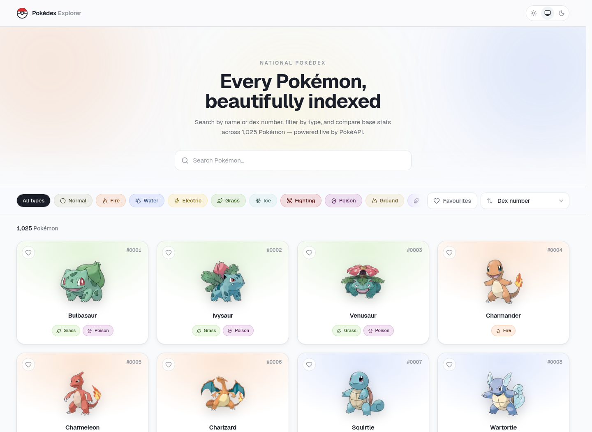
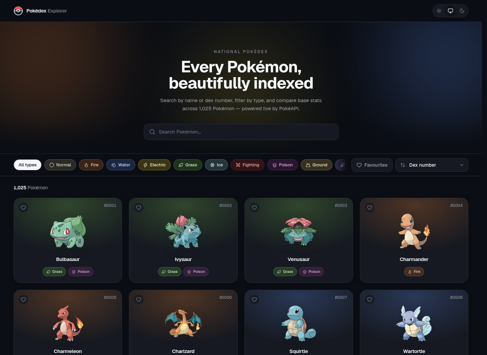
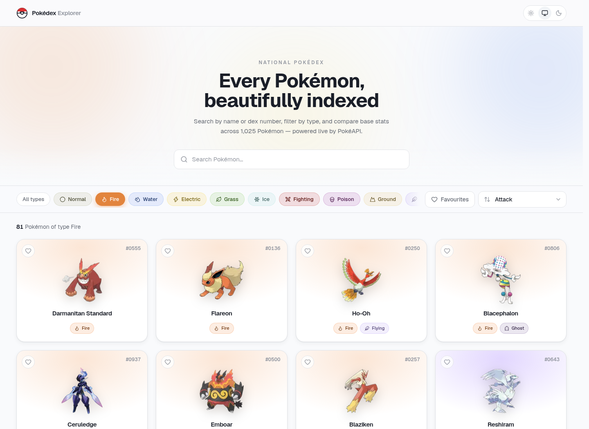
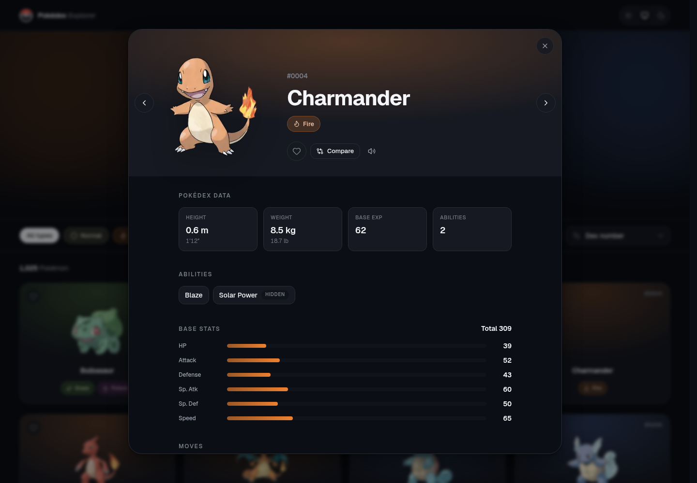
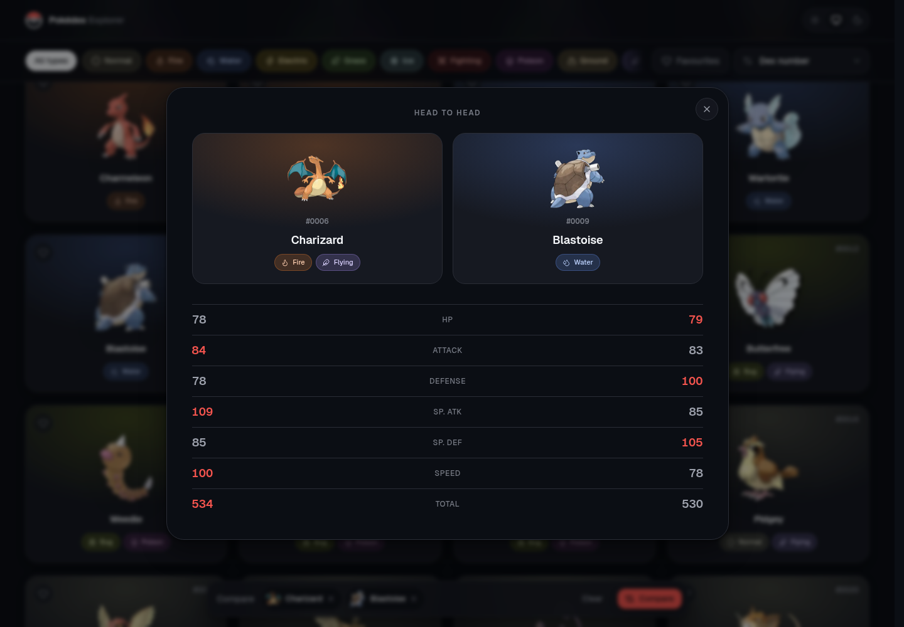
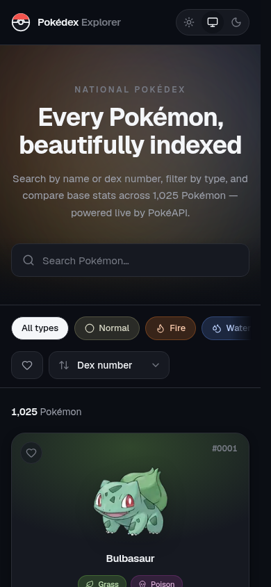

# Pokédex Explorer

A production-grade Pokédex built on the free [PokéAPI](https://pokeapi.co). Search, filter, sort
and compare all 1,025 Pokémon — with a virtualised grid, shared-element transitions, full keyboard
support and a light/dark design system.



---

## Features

**Browsing**

- Virtualised card grid over the full National Pokédex — 1,025 entries scroll at 60fps because only
  the rows near the viewport exist in the DOM.
- Each card carries its dex number, official artwork, name and types, on a background washed with
  its primary type's colour.
- **Load More** by default (`Load 24 more · 1,001 left`), with an opt-in *keep loading as I scroll*
  toggle backed by `react-infinite-scroll-component`.

**Search**

- Typeahead that resolves on the same frame as the keystroke — it runs against a cached name index,
  not a request per character.
- Accepts names, partial names, fuzzy input (`chrzd` → Charizard) and raw dex numbers.
- Misses get a designed empty state with **did-you-mean** suggestions derived from edit distance.

**Filtering & sorting**

- Filter by any of the 18 types; selecting several is an AND (`Fire + Flying`).
- Sort by dex number, name, HP, Attack, Speed or base stat total.
- Search, filters and sort all live in the URL — `/?q=char&type=fire&sort=attack` is shareable and
  survives a refresh.

**Detail view**

- Clicking a card opens `/pokemon/[name]` as a modal *over* the grid via a Next.js intercepting
  route, so scroll position is preserved and the artwork animates from card to panel.
- The same URL loads as a full, server-rendered page on a direct visit or refresh, with real
  metadata for link previews.
- Large artwork, dex number, types, height and weight (metric + imperial), abilities with hidden
  ones badged, animated base stat bars with a total, and moves grouped by learn method.
- `←` / `→` walk the dex; `Esc` closes; the modal becomes a draggable bottom sheet under 768px.

**Extras**

- ⭐ Favourites, persisted to `localStorage`, with a favourites-only filter.
- ⭐ Light / dark / system theme, applied before first paint — no flash of the wrong theme.
- ⭐ Compare any two Pokémon head-to-head, with the higher stat highlighted per row.
- ⭐ Full keyboard operation: arrow keys cross the grid, `Home`/`End` jump to the ends, `Enter`
  opens, `Esc` closes, and focus returns to the card you came from.
- ⭐ Pokémon cries, playable from the detail view.

| | |
|---|---|
|  |  |
|  |  |
|  |  |

<p align="center"></p>

---

## Tech Stack

| Concern | Choice | Why |
|---|---|---|
| Framework | **Next.js 16** (App Router) + **React 19** | Intercepting routes give a modal over the grid *and* a real shareable page from one route |
| Language | **TypeScript** (strict) | No `any`, no `@ts-ignore` in the codebase |
| Server state | **TanStack Query v5** | `queryOptions` factories, pooled batch fetches, 404-aware retries |
| Client state | **Zustand** + `persist` | Preferences only — favourites, comparison slate, auto-load |
| Styling | **Tailwind CSS v4** | CSS-first `@theme` tokens; no colour is hardcoded in a component |
| Components | **shadcn/ui** patterns on Radix | Hand-placed primitives in `components/ui`, owned by this repo |
| Animation | **Motion** (`motion/react`) | Shared-element transitions, spring physics, global reduced-motion |
| Virtualisation | **TanStack Virtual** | Window virtualiser with a constant row height |
| Infinite scroll | **react-infinite-scroll-component** | Drives the optional auto-load mode |
| Icons | **lucide-react** | One icon per Pokémon type |
| Lint / format | **Biome** + **oxlint** | Biome owns formatting, imports and a11y; oxlint adds a fast correctness/perf pass. Overlapping rules are disabled on one side so they can never disagree |

The ambient hero backdrop is adapted from the [React Bits](https://reactbits.dev) *Aurora* idea,
rebuilt as pure CSS so it costs no JavaScript.

---

## API Used

[PokéAPI v2](https://pokeapi.co/docs/v2) — `https://pokeapi.co/api/v2`. No authentication required.

| Endpoint | Used for |
|---|---|
| `GET /pokemon?limit=100000&offset=0` | The name index — every name and id in one cached request |
| `GET /pokemon/{name}` | Full detail record for a card, modal or page |
| `GET /type/{type}` | Type membership lists, intersected client-side |

Artwork comes from the PokéAPI sprites CDN, addressed by dex id.

---

## Installation

```bash
git clone <your-fork-url> pokedex-explorer
cd pokedex-explorer
pnpm install
```

Requires Node 20+ and pnpm 9+. No environment variables and no API key.

## Running Locally

```bash
pnpm dev        # http://localhost:3000
pnpm build      # production build
pnpm start      # serve the production build
pnpm typecheck  # tsc --noEmit
pnpm lint       # biome check + oxlint
pnpm format     # biome check --write
```

---

## Project Structure

```
src/
├── app/                          # Next.js App Router
│   ├── layout.tsx                # shell, providers, pre-paint theme script
│   ├── page.tsx                  # the explorer
│   ├── @modal/                   # parallel slot
│   │   └── (.)pokemon/[name]/    # intercepted detail → modal over the grid
│   └── pokemon/[name]/           # the same URL as a full SSR page
│
├── components/
│   ├── ui/                       # button, skeleton, tooltip, responsive-modal
│   ├── layout/                   # header, theme toggle, aurora
│   ├── pokemon/                  # card, grid, detail, stat bar, type chip, skeletons
│   └── states/                   # empty + error screens
│
├── features/                     # vertical slices
│   ├── explorer/                 # page composition, load-more
│   ├── search/  filters/  compare/
│
├── hooks/                        # feed, detail, URL params, column count, keyboard nav
├── lib/
│   ├── api/                      # the only place this app calls fetch
│   ├── query/                    # query keys, options factories, client config
│   ├── pokemon/                  # type metadata, sort logic
│   └── utils/                    # formatters, sprite URLs, fuzzy matching
├── stores/                       # zustand ui store
└── types/                        # wire + domain types
```

Two rules keep this honest:

1. **One fetch site.** Only `lib/api/client.ts` calls `fetch`. Everything else goes through
   `lib/api/pokemon.ts`, which normalises wire shapes into domain types — no component ever sees a
   raw `PokemonDetailResponse`.
2. **One owner per piece of state.** TanStack Query owns everything from the network, the URL owns
   search/filters/sort/selection, and Zustand owns preferences. Nothing is owned twice.

---

## Challenges Faced

**The list endpoint tells you almost nothing.** `GET /pokemon?limit=20` returns only `{ name, url }`
— no image, no types. The obvious implementation fetches 20 detail records before painting anything,
which is a 20-request waterfall in front of first paint. Instead: the dex id is parsed out of the
resource URL, artwork is addressed directly on the sprites CDN from that id, and the card paints
immediately with a shimmering placeholder where its type chips will go. Detail records then hydrate
in the background. Because the card box is a fixed size from the very first frame, **cumulative
layout shift is zero** even though the content streams in.

**Filtering by type breaks pagination.** `/type/fire` returns all 81 members at once with no
pagination and no detail, so `?limit=24&offset=0` no longer describes anything real. The fix was to
stop paginating against the API at all: one cached call per type, sets intersected client-side, then
the *result list* is sliced into pages of 24. Switching or combining type filters after the first
visit costs zero requests, and Load More behaves identically filtered or not.

**Sorting by a base stat needs data you don't have yet.** You cannot sort 1,025 Pokémon by Attack
without 1,025 detail records. Rather than quietly sorting whatever happened to be on screen — which
looks like a bug to anyone paying attention — a stat sort hydrates a bounded pool of up to 300
records through a concurrency-limited fetcher (8 in flight, not 300), seeds every individual query
cache so the resulting cards render from memory, and tells the user plainly when the sort covers
only part of the set. Under a type filter the whole set fits inside the pool, so those sorts are
exact.

**Search that feels instant.** A request per keystroke feels sluggish no matter how fast the API is.
`GET /pokemon?limit=100000` returns the entire dex — every name and id — in one ~90KB response.
Cached with `staleTime: Infinity`, that single call powers typeahead, exact result counts, stable
pagination under any filter, and did-you-mean suggestions, all without another round trip.

**The modal-versus-page problem.** A detail view that is only a modal isn't shareable; one that is
only a page loses your scroll position and can't animate from the card. Next.js intercepting routes
give both from one URL: clicking a card renders `/pokemon/[name]` into a parallel `@modal` slot while
the grid stays mounted underneath, and loading that same URL directly renders a full server-rendered
page. The grid staying mounted is also what makes the shared-element artwork transition possible.

**A scroll-anchoring fight.** The virtualised grid oscillated: scroll position and document height
flipped between two values every frame. Chrome's scroll anchoring was choosing a card row as its
anchor, the virtualiser was recycling that row out of the DOM, the browser was "correcting" the
scroll position to compensate, and the two fed each other indefinitely. One line —
`overflow-anchor: none` on the virtual container — ends it. It's the kind of bug that only shows up
once you combine window virtualisation with a long page, and it's worth knowing about.

---

## Future Improvements

- **Evolution chains and type effectiveness.** `/evolution-chain` and `/type` damage relations are
  the two things a real Pokédex has that this one doesn't.
- **Server-prefetched first page.** Hydrating the React Query cache on the server would let the
  first screen of cards arrive with the HTML instead of after it.
- **A proper stat-sort index.** A build-time generated JSON of all 1,025 stat lines (~60KB) would
  make every stat sort exact and instant, retiring the bounded-pool compromise.
- **Compare more than two.** The tray and the table are both written around a pair; three or four
  columns is mostly a layout problem.
- **Tests.** The interaction surface — search, filter intersection, sort, favourites persistence,
  modal routing — was verified with a Playwright script during development. That deserves to be a
  committed suite rather than a throwaway.
- **`View Transitions`.** Once support is broad enough, the card-to-modal animation could drop
  Motion's layout projection for the native API.

---

Pokémon and Pokémon character names are trademarks of Nintendo. Data provided by
[PokéAPI](https://pokeapi.co).
